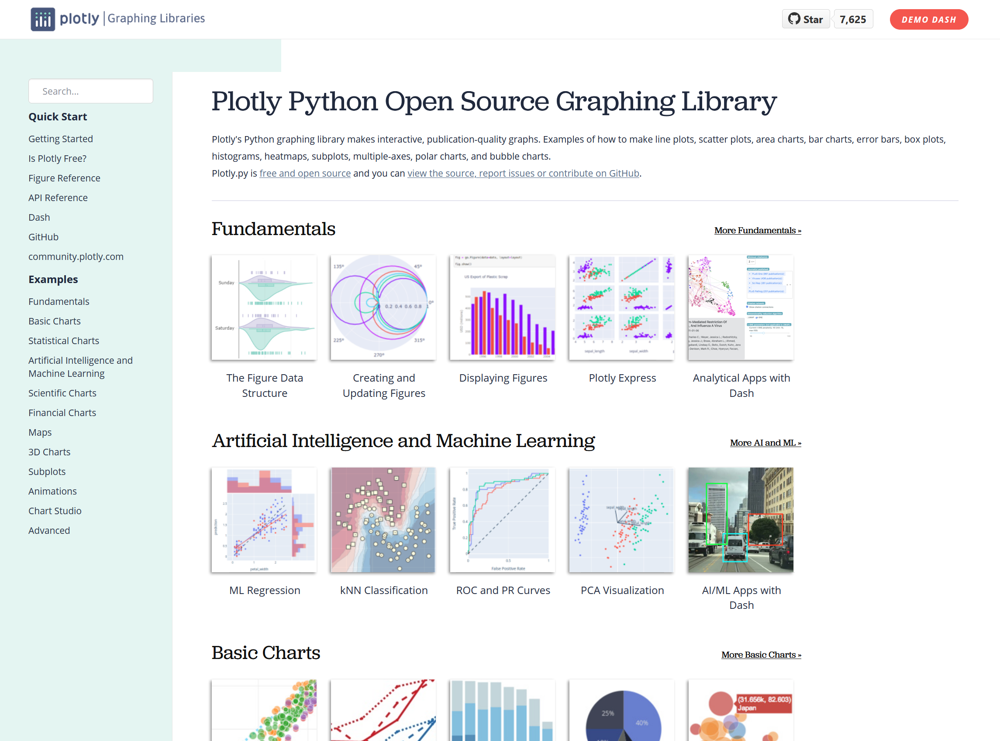
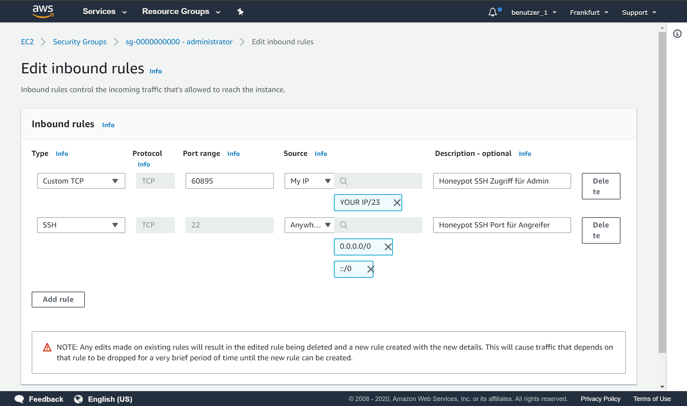
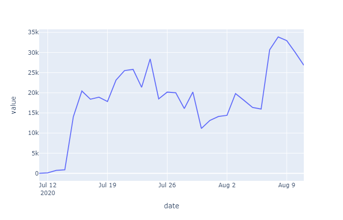
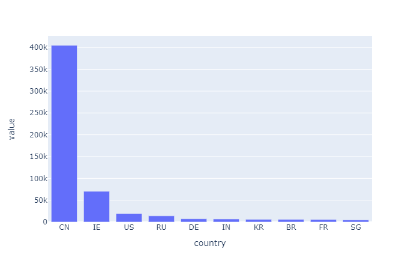
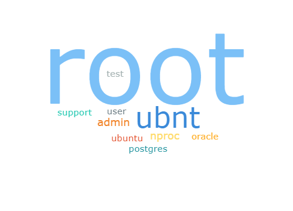
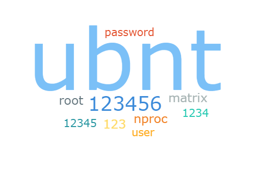
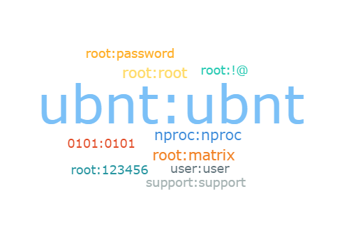
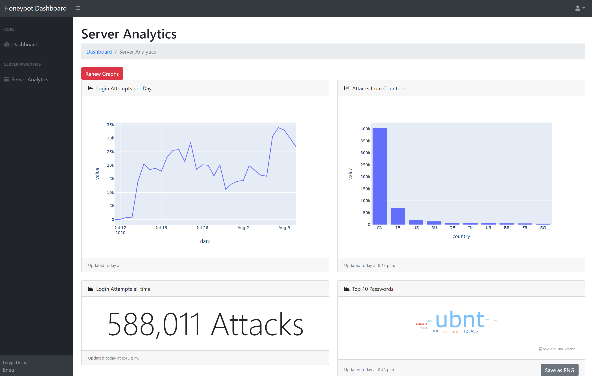
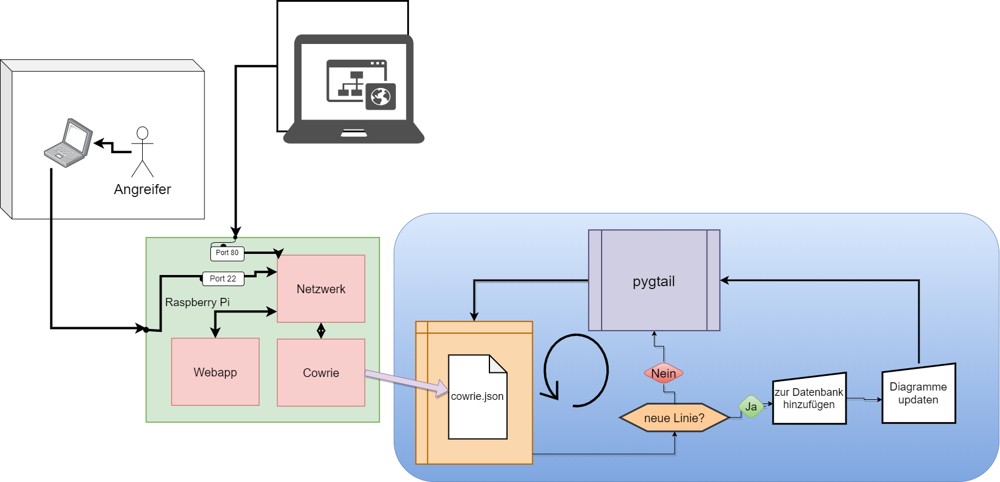

Einleitung und Fragestellung
============================

Die Idee zum Einstieg ins Themenfeld von Cyber-Sicherheit bekam ich beim
lesen eines Tweets, welcher dazu führte, dass ich im Internet nachlas,
was denn Cyber-Sicherheit überhaupt ist, und welche verschiedenen
Themenfelder existieren. Ein Artikel in der Neuen Zürcher Zeitung,
geschrieben von Mäder [^1], hat mich überzeugt, in meiner Arbeit den Fokus
definitiv auf die Cyber-Sicherheit zu legen. Der Artikel handelt von
Hacker-Angriffen auf Spitäler. Angesichts zunehmender Home-Office-Arbeit
wegen der Pandemie interessiert mich die Frage, unter welchen
Sicherheitsbestimmungen zuhause beruflich gearbeitet wird. Dies bedeutet
für einen Sicherheitsverantwortlichen bei einer Organisation die
Bereitstellung eines VPN- oder RDP-Zugangs. Denn die Arbeitnehmer müssen
naturgemäss dauernd Zugriff auf firmeneigene Netzwerke haben.

Die vorliegende Arbeit handelt von Cyber-Sicherheit, im Spezifischen von
Honeypots. Hierzu wird der Honeypot Cowrie auf dem EC2 Cloud Server von
AWS installiert, um für insgesamt einen Monat Daten zu sammeln. Diese
gesammelten Daten werden mit Hilfe einer selbst programmierten Webapp
analysiert und visualisiert. Die Analyse dient der Beantwortung der
Leitfrage. Die Kombination von Honeypot und Webapp führt zu einem
Produkt, welches auf einem Raspberry-Pi läuft. Das Ziel des Produktes
ist es, Laien, welche ein Interesse an den Methoden eines Hackers haben,
ein Sprungbrett in die Cyber-Sicherheit zu verschaffen.

Die Analyse der vom Honeypot gesammelten Daten sowie auch die
dazugehörigen Visualisierungen sind Gegenstand der vorliegenden Arbeit
mit folgender Leitfrage:

-   "Ist ein Honeypot mit Webapp eine effektive Methode zum präventiven
    Schutz eines Heimnetzwerkes?"

Nachforschungen in Literatur
============================

Cybersecurity Übersicht
-----------------------

Der Begriff Cyber-Sicherheit umfasst eine Reihe von verschiedenen
Aspekten wie die Informationssicherheit, Applikationssicherheit,
Netzwerksicherheit und die Operationssicherheit.

Im Jahr 2019 wurden laut Risk Based Security [^2] über 15.1 Milliarden persönliche
Datensets aufgrund von Datenlecks exponiert. Nach dem Rekordjahr 2019 ist die
Sicherheit von Netzwerken noch wichtiger als zuvor. Es wird vermutet,
dass im Jahr 2020 die Anzahl der Cyber-Attacken weiter zunehmen werden.

Für Unternehmen sind Honeypots ein wichtiger Bestandteil der
Identifizierung von potenziellen Angreifern. Denn Unternehmen können mit
Daten, die sie von einem Honeypot kriegen, eine Struktur auflegen,
welche das Vorgehen eines Angreifers aufzeigt. Diese Struktur mit dem
Namen "Cyber Kill Chain", wird von Lockheed Martin [^3] entwickelt, ein globales
Unternehmen für Sicherheit und Luft- und Raumfahrt.

### Netzwerksicherheit

Die Netzwerksicherheit ist nach Kaspersky [^4] eine Methode zur Absicherung eines
Netzwerks. Der Honeypot gehört zum Umfeld der Netzwerksicherheit, da er
bei der Erkennung eines Hackers und dessen Methoden eine Hilfe ist. Ein
Honeypot selber schützt nicht. Er ist ein Mittel, das Informationen
liefert. Mit Hilfe dieser Informationen wird ein Netzwerk danach
abgesichert.

Begriffserklärungen
===================

Cyber Kill Chain
----------------

Um die Abfolge eines Cyber-Angriffes zu beschreiben, hat Lockheed Martin
den Cyber Kill Chain Lockheed Martin [^5] entwickelt. Dieser soll eine
Grundlage darstellen, um einen Cyber-Angriff mit mehreren Etappen zu
beschreiben. Nach Schmitz [^6] sind die Etappen, welche ein Angreifer
typischerweise durchläuft, die folgenden:

-   **Identifizierung des Zieles:** Der Angreifer sucht öffentlich über
    das Ziel verfügbare Informationen wie E-Mail-Adressen, Informationen
    über das Unternehmen und dessen IT-Systeme.

-   **Präparation des Angriffs:** Die passenden Angriffswerkzeuge werden
    zusammengestellt. Oft bestehen diese aus einem
    Exploit und
    einer Malware.

-   **Beginn des Angriffs:** Der Angriff wird gestartet und das
    Malware-Exploit-Paket wird je nach Angreifbarkeit mit Hilfe eines
    USB-Sticks, eines Social-Media-Posts oder einer infizierten Website
    ausgeliefert.

-   **Zugriff auf Opfer:** Eine Schwachstelle wird ausgenutzt um Zugriff
    auf den Computer eines Opfers zu bekommen. Diese Schwachstelle kann
    in einer Software existieren. Eine andere Schwachstelle kann auch
    ein Mitarbeiter sein. Der mit Hilfe von
    Social Engineering dazu bewogen worden ist, eine
    böswillige Software auszuführen.

-   **Brückenkopf wird errichtet:** Der Angreifer
    installiert eine Backdoor und versteckt
    Malware im
    Computersystem des Opfers.

-   **Command and Control (C2):** Um die
    Malware aus
    der Ferne zu bedienen, hält der Angreifer Ausschau nach möglichen
    Kommunikationskanälen. Diese werden geöffnet und anschliessend wird
    das System gesteuert. Welches des Öfteren unter Verwendung von
    abläuft.

-   **Ziel der Mission erreichen:** Ein Angreifer hat etwas vor. Es
    existiert ein Ziel. Dieses Ziel will nun nach den obgenannten
    Schritten erreicht werden. Ein Ziel kann es sein, das Netzwerk
    auszulöschen oder vertrauliche Daten darin zu finden.

SSH (Secure Shell Protocol)
---------------------------

SSH oder auch Secure Shell Server ist ein Netzwerkprotokoll, mit dem man
auf die Konsole, das Text In/Output Feld, womit der Computer gesteuert
wird, zugreift. Die Funktion des SSH-Protokolls oder eher des
"Tochterprotokolls" namens Secure-File-Transfer-Protokoll, besteht
darin, Dateien über ein Netzwerk zu transferieren, sei dies lokal oder
über das World-Wide-Web.

Honeypot
--------

Ein Honeypot - oder in Deutsch Honigtopf - ist eine Falle, die man in
der Computersicherheitsindustrie benutzt, um Angreifer mit einem System
abzulenken das nur so scheint als wäre es "the real deal". Dieses
System wird oftmals in einer virtuellen Umgebung aufgesetzt, denn falls
ein Angreifer etwas anrichtet, was zum "Tode" des Systems führen
würde, kann man dieses einfach auf einen Punkt vor dem Zwischenfall
zurücksetzen. Der Name Honeypot hat seinen Ursprung in der Strategie,
Bären mit Hilfe von Honigtöpfen als Köder abzulenken und zu
beschäftigen, so dass sie ihren eigentlichen Plan vergessen.
[^7]

In der Welt der Computersicherheit gibt es verschiedene Honeypots. Auf
der einen Seite gibt es Server-seitige Honeypots. Das sind Honeypots,
welche auf dem Server als Falle existieren und jegliche Angriffe
aufzeichnen. Auf der anderen Seite gibt es Client-seitige Honeypots. Das
sind Honeypots, die sich als Benutzer wie z.B. in der Form eines
Browsers ausgeben und Daten über Websites sammeln, welche den Benutzer
anzugreifen versuchen. [^8]

Nach `ionos.de` [^8] gibt es zwei
verschiedene Weisen, Honeypots zu implementieren. Zum einen passiert
dies auf einem physischen Rechner, zum anderen in virtueller Form wie
z.B. mit (Quick Emulator).

Stufen von Interaktivität
-------------------------

Einfacheitshalber werden nachfolgend nur die Server Honeypots
beschrieben, da diese in der vorliegenden Arbeit ein Thema bilden
werden. Auf die Client-seitigen Honeypots wird nicht eingegangen.

-   **Low-Interaction-Honeypots\
    ** Diese Art von Honeypots wird gemäss Hoopes [^9] oft benutzt, um Virusproben zu sammeln. Dieser Honeypot
    ist einer, welcher der Sammlung von Viren dient, zugleich auch
    andere Verwendungendungsfälle hat. Die praktische Implementierung
    eines Low-Interaction-Honeypots ist einfach im Vergleich zu der von
    anderen Honeypots mit höheren Interaktivitäts-Graden.

-   **Mid-Interaction-Honeypots\
    ** Medium-Interaction-Honeypots stellen nach
    Lance [^10] mehr Möglichkeiten in
    Form von Interaktivität, zur Verfügung, als
    Low-Interaction-Honeypots. Diese Art von Honeypots werden
    üblicherweise in Unternehmensumgebungen implementiert. Die
    Medium-Interaction-Form kommt dann in Frage, wenn ein Honeypot
    relativ kostengünstig sein soll. Das bedeutet konkret, dass ein
    solcher Honeypot fortlaufend betrieben wird.

-   **High-Interaction-Honeypots\
    ** Ein High-Interaction-Honeypot ist im Grunde ein echtes System,
    das sowohl in einer virtuellen als auch in einer physischen Umgebung
    ausgesetzt wird. Hier besteht die hohe Gefahr, dass ein Angriff auf
    wichtige Systeme erfolgt wie z.B. die Website eines Unternehmens.
    Diese Gefahr besteht, wenn das angreifbare System nicht gut genug
    abgeschirmt sind vom Rest. D.h. es ist unerlässlich, solche Systeme
    vom Rest einer Organisation oder eines privaten Netzwerks
    abzuschirmen, wie auf `ionos.de` [^8]
    zu entnehmen ist.

Verschiedene Honeypots
----------------------

### Glastopf

Glastopf ist ein Low-Interaction-Honeypot, der Webapp-Schwachstellen
nachahmt. Dieser Honeypot ist einer der bekanntesten
Web-Applikations-Honeypots. Was diesen Honeypot speziell macht, ist sein
Ansatz. Denn er ist anders als jener von gleichwertigen Produkten.
Glastopf emuliert eine Website. Diese schaut aus der Perspektive eines
Angreifers wie eine Website aus, die angreifbar ist. Hinter den Kulissen
aber wird die Website mit den Sicherheitslücken von allen vorherigen,
von Hackern angegriffenen, Websites ausgestattet.

### Mailoney

Mailoney von awhitehatter [^11] ist ein Low-Interaction-SMTP-Honeypot,
geschrieben in Python. Der Honeypot emuliert SMTP. Dabei
handelt es sich um das Protokoll, welches benutzt wird zur Versendung
von E-Mails. Mailoney hilft beim Identifizieren der Quelle von
Spam-E-Mails. [^11]

Cowrie SSH Honeypot
-------------------

Der Cowrie Honeypot von Osterheim [^12], eine Fork von Kippo, ist ein
Medium- zu High-Interaction-SSH und Telnet-Honeypot. Cowrie speichert
sowohl Logindaten von Angreifern als auch die Befehle, welche ausgeführt
wurden. Hochgeladene Dateien werden ebenfalls gespeichert und zur
späteren Analyse bereitgestellt. Die High-Interaction-Funktionalität des
Honeypots ermöglicht es dem Nutzer, die SSH-Traffic zu einem anderen
System zu analysieren. Der Honeypot selber ist nicht vom Typ
High-Interaction. Er kann jedoch mit Hilfe von zusätzlichen Programmen,
wie zu solch einem Typ von Honeypot mutiert werden. Dieser Honeypot
basiert auf der Programmiersprache Python.

Im Grunde hat der Honeypot zwei verschiedene Verwendungsmöglichkeiten:
Eine davon ist das Emulieren von einem Server, der einen SSH-Zugang
bereitstellt. Diese Emulation ist jedoch nicht vollständig. D.h. nicht
ein ganzes Linux System wird emuliert, sondern nur die üblichsten
Befehle. So hat es auch im
"Fake" Dateisystem nur die Dateien, welche man üblicherweise
auf einem Linux System findet. Die andere Verwendungsmöglichkeit von
Cowrie ist das Weiterleiten von einer SSH-Anfrage auf ein echtes System.
Hier zeichnet Cowrie die gleichen Daten auf wie bei der Emulation. Diese
zweite Verwendungsmöglichkeit hat den grossen Vorteil, das echte System
für einen Angreifer real erscheinen zu lassen, was wiederum eine höhere
Wahrscheinlichkeit nach sich zieht, dass entweder die Person oder das
Programm die eigenen Methoden enthüllt.

Cowrie sammelt viele Daten. Im Grunde werden von einem Angreifer
folgende Daten abgespeichert: Der Benutzername und das Passwort, mit
welchem versucht wurde sich einzuloggen sowie die IP-Adresse und die
eingegebenen Befehle. Zusätzlich speichert Cowrie auch die von den
Angreifern hochgeladenen Dateien.

Cowrie bietet viele Möglichkeiten, um die gesammelten Daten direkt in
andere Programme einzuspeisen. Wenn an der Konfiguration nichts geändert
wurde, dann speichert Cowrie die gesammelten Daten in "Log" Dateien.
Diese sind in User Mode Linux () kompatiblen Format, sodass sie mit
einem integrierten Programm wiedergegeben werden können. Andere
Plugin, welche
die Einspeisung der Daten in eine SQL-Datenbank oder in ein Statistik
Programm wie z.B. Elastic Stack ermöglichen, können zusätzlich aktiviert
werden.

Django
------

Django ist ein Framework, welches primär für die Programmierung
von Webapps und APIs existiert. Dieses
Framework
basiert auf der Python-Programmiersprache und wurde von
Webentwicklern für Webentwickler programmiert.

Das Framework, welches mit Django installiert wird,
generiert sogenannte "Projekte". Diese beinhalten alle Einstellungen für
die Webapp. Weiter generiert dieses Programm auch "Applikationen",
welche den eigentlichen Programmcode beinhalten, der ausgeführt wird.
Schon mit wenigen Zeilen von Code kann mit Hilfe von Django eine
funktionelle und dynamische Webseite erstellt werden.

Cloud Server
------------

Eine Cloud ist ein virtueller Computer, der bei einem Cloud-Provider
gemietet wird, und auf welchem Programme installiert werden und
anschliessend laufen. Ein Kleinunternehmen zum Beispiel mietet eine
solche Cloud, um dort ihre Website zu hosten.

Diese Clouds haben gemäss Red Hat, Inc. [^13] die Option von Skalierbarkeit,
welche es ermöglicht, die Spezifikation eines Servers, z.B. bei mehr
Anfragen auf eine Website, anzupassen. Dies dient der Bewältigung einer
höheren Arbeitsbelastung..

Cloud-Provider sind Firmen, die Informatikinfrastruktur, wie z.B.
öffentliche Clouds oder auch private Clouds, zur Verfügung stellen. Nach Red Hat, Inc. [^13] sind die nachfolgend genannten Provider die bekanntesten und
grössten Cloud-Provider: Alibaba Cloud, Amazon Web Services (AWS),
Google Cloud, IBM Cloud und Microsoft Azure.

### EC2-Instanzen

Auf der Cloud-Provider-Plattform gibt es die Möglichkeit eine Elastic
Compute Cloud (EC2) zu mieten. Diese ist skalierbar, d.h. je nach
Ausnutzung der Ressourcen kann das Abonnement so angepasst werden, dass
nicht mehr als nötig für benutzte Ressourcen bezahlt wird. [^14]

Raspberry Pi
------------

Der Rasperry Pi der Raspberry Organisaton [^15] ist ein Einplatinencomputer,
welcher als einfachen Einstieg in die Welt von Linux und dem
Programmieren entwickelt wurde. Der Computer hat alle Komponenten auf
einer einzigen Platine. Dies sind das Grafikchipset, der Prozessor und
der Internetanschluss. Wie Abbildung 1 zeigt ist die Grösse des
Raspberry Pis vergleichbar mit derjenigen einer Kreditkarte.

Material und Methoden
=====================

Materialien
-----------

Nachfolgend werden die verschiedenen Materialien beschrieben, welche für
die Kollektion der Daten gebraucht werden.

### Betriebssystem für Honeypot

Entwickelt wurde Cowrie für ein Linux basiertes Betriebssystem. Es kann
jedoch auch auf anderen Betriebssystemen installiert werden. Dort ist
die Stabilität jedoch nicht garantiert. Der Honeypot läuft für die
Zeitspanne von 30 Tagen. Darum ist es wichtig, dass dieser mit hoher
Wahrscheinlichkeit funktioniert. Linux ist deshalb die beste Option. Der
Cloud Provider AWS hat verschiedene Auswahlmöglichkeiten an Linux
Betriebssystemen. Der Entscheid fiel auf Ubuntu, da es Open Source ist
und die Lernkurve kleiner ist als bei Amazon Linux, welches andere
Befehle und Module mitliefert.

### Visualisierungsmodul

Ausgewählt für ein Visualisierungsmodul, mit welchem die Diagramme auf
der Webapp generiert / konstruiert werden, getestet für Verwendbarkeit
in der Webapp, wurden vorwiegend Javascript Module, wie Chart.js oder
D3.js. Diese haben eine grosse Lernkurve, welche zeitlich nicht
unterstützbar ist. Plotly ist ein Pythonmodul, das Javascript Diagramme,
mit Hilfe von Dateneingaben vom Python Code generiert.

Plotly ist ein einfach zu erlernendes Modul. Es dient zur Visualisierung
von Daten in einer Webapp, welche in Python geschrieben wird.

Das Modul Plotly ist gut aufgebaut. Es hat nicht alle Typen von
Diagrammen, welche für diese Arbeit gebraucht werden. Des fehlt die
Wortwolke deshalb wird AnyChart.js für diesen Diagramm-Typ benutzt.
Diese beiden Module wurden aufgrund ihrer einfachen Benutzung
ausgewählt.

Es werden Daten mit Hilfe eines Honeypots gesammelt. Dieser Honeypot
läuft auf einem Server der Amazon Web Services (AWS). Zur Auswahl stehen
verschiedene Server Lösungen von AWS. Es gibt jedoch nur zwei Angebote,
welche passend für diese Arbeit sind. Der eine ist ein Virtual Private
Server (VPS) und der andere eine EC2-Instanz von Amazon. Da die
vorliegende Arbeit ein Nullbudget hat, wurde eine EC2-Instanz
ausgewählt. Diese läuft ein Jahr gratis auf einem Server, der mit
anderen Benutzern geteilt wird. Auf der AWS Plattform unter EC2
Instanzen gibt es verschiedene Pläne, welche diverse Konfigurationen zur
Verfügung stellen. Für diese Arbeit wird eine EC2-Instanz mit dem
«t2.micro»-Plan und dem Ubuntu Betriebssystem aufgesetzt, da dieser Plan
im oben erwähnten Gratisjahr von AWS inbegriffen ist. [^16]

Warum diese Materialien?
------------------------

Im Prozess der Recherche wurde Cowrie als Honeypot ausgewählt, da dieser
eine umfangreiche Dokumentation aufweist. Ein anderer Grund, warum
dieser Honeypot ausgewählt wurde, ist, dass man als Neuling den Honeypot
mit relativ wenig Aufwand installieren und aufsetzen kann.

Der Entscheid für den Cloud-Server ist auf AWS gefallen, da man für
zwölf Monate, solange man eine valide Kreditkarte vorweist, gratis einen
Server einrichten kann. Der Cowrie Honeypot läuft auf einer EC2 Instanz.

Ausgewählt wurde Django aufgrund der Lernkurve bei anderen
Frameworks,
wie z.B. Angular. Dies ist ein Webframework geschrieben in JavaScript
und verwaltet von Google. Dazu kommt, dass Django eine Objekt
relationale Abbildungsmethode hat, welche es ermöglicht, auf eine
Datenbank mit Objekt orientierten Modellen zuzugreifen.

Vorgehen
--------

### Setup von AWS

Sobald die EC2-Instanz aufgesetzt ist werden einige für diese Arbeit
notwendigen Änderungen daran vorgenommen. Als erstes wird der
«Sicherheits-Gruppen»-Panel im EC2-Panel geöffnet. Darin wird die frisch
kreierte Sicherheitsgruppe geöffnet und die «inbound rules» werden
bearbeitet. Wie Abbildung 4 zeigt, wird eine erste Regel für den Port
60895 kreiert. Dieser wird von der Seite des Administrators her benutzt
für den SSH Zugriff auf den Server. Die zweite Regel ist für den SSH
Zugriff vom Angreifer. Wie auf der Abbildung 3 zu sehen ist, kann jeder
auf diesen Port zugreifen. Auf den Port in der ersten Regel kann man nur
mit einer spezifischen IP-Adresse zugreifen.

### Installation von Cowrie

Die Software für den Honeypot ist Open Source. Um den
Installationsprozess des Honeypots auf dem Server zu vereinfachen, ist
ein Skript dafür im Anhang enthalten. Dieses Skript aktualisiert die
installierten Pakete, und es lädt die für die Installation notwendigen
Pakete herunter. Nach der Installation der Pakete kreiert das Skript
einen neuen Benutzer für Cowrie und ändert auch den Port für SSH. Danach
lädt das Skript das Projektarchiv des Honeypots «Cowrie» von GitHub
herunter und speichert dies in Cowries' Benutzerordner ab. Die
Konfigurationsdatei wird ersetzt durch diese, welche im Anhang zu finden
ist.

### Aufbereitung der gesammelten Daten

Nach der Kollektion aller JSON-Dateien werden diese in eine SQLite
Datenbank importiert. Auf diese Datenbank wird mit einem
Python Skript
zugegriffen. Dieses Skript benutzt Funktionen und Klassen von Django,
damit der Gebrauch von nicht nötig ist. Diese Funktionen, bereitgestellt
von Django, sind Objekt orientiert. Das bedeutet, dass eine Klasse
geschrieben wird, die als Vorlage dient. Mit Hilfe dieser Klasse lassen
sich Daten in die Datenbank hinzufügen, löschen und auch verändern.

Das Python
Skript kombiniert alle JSON-Dateien zu einer einzelnen Datei. Durch den
Gebrauch von if-else Anweisungen werden von jeder Linie nur die
Informationen, die gebraucht werden, in die Datenbank abgespeichert.
Spezielle Informationen erfordern spezielle Aufbereitung, z.B. muss das
Herkunftsland der IP-Adressen bestimmt werden.

### Generierung der Visualisierungen

Die Visualisierungen, mit Ausnahme von den Wörterwolken, werden mit
Hilfe des Python-Moduls Plotly generiert. Wörterwolken-Visualisierungen
werden nicht direkt mit dem Python-Skript generiert, da dies ein
Javascript Modul ist.

-   **Loginversuche pro Tag\
    ** Bei dieser Visualisierung werden von der Datenbank Informationen
    über die Anzahl Angriffe an einem gegebenen Tag eingeholt.

-   **Loginversuche sortiert nach Ländern\
    ** Wichtig war es hier, dass nur die 10 Länder mit den meisten
    Angriffen an das Frontend gesendet werden. Diest ist im
    Balkendiagramm in Abbildung 5 enhalten.

-   **Loginversuche ganze gemessene Zeit\
    ** Dies ist die einfachste Visualisierung, denn diese besteht aus
    einer Zahl. Auch hinter den Kulissen passiert nicht viel. Die
    Funktion zählt die Anzahl Login-Versuche und gibt diese zurück.

-   **Top 10 Benutzer, Passwort und Kombination\
    ** Die Anmeldeinformationen, welche von einem Angreifer oder dessen
    Skript benutzt wurden, werden visualisiert. Die erste der drei
    Visualisierungen zeigt in Form von einer Wörterwolke, welches die
    meist ausprobierten Benutzernamen waren. Die zweite Visualisierung
    führt zum gleichen Ergebnis wie die erste, jedoch mit dem
    Unterschied dass sie die am meist probierten Passwörter
    visualisiert. Zuletzt folgt nun die Visualisierung, welche aus einer
    Kombination der beiden ersten besteht. Das bedeutet, dass diese
    aufzeigt, welches die am meisten ausprobierte Benutzernamen- und
    Passwort-Kombination gewesen sind.

Ergebnisse
==========

Angriffe per Zeit
-----------------

Es wurde untersucht, wie oft der Honeypot über die Zeitspanne von 30
Tagen angegriffen wird. Im Verlauf dieser Zeit gingen 588'011
Loginversuche vonstatten. Täglich wurde im Durchschnitt 18375,34 Mal
probiert sich in den Honeypot einzuloggen. Am vierten Tag wurde die
IP-Adresse des Honeypots von Shodan "gescraped" und folglich auf ihrer
Website publiziert, was zu vermehrter "Traffic" führte. Shodan ist ein
Service, der das ganze Internet scannt. Es scannt die am häufigsten
benutzten Ports einer gegebenen IP-Adresse.

Angriffe per Land
-----------------

Untersucht wird hier, wie oft der Honeypot nach Ländern sortiert
angegriffen wird. In Abbildung 5 sind die zehn Länder, von welchen am
meisten Loginversuche stammen, ersichtlich. China ist das Land, von dem
am meisten Versuche ihren Ursprung haben. Bei genauerer Analyse wurde
klar, dass diese Loginversuche von einer einzelnen IP-Adresse stammen.
Dies führt zur Konklusion, dass dieser Akteur sich mit Hilfe von
Bruteforce
versuchte in den Honeypot einzuloggen.

Top 10 Benutzernamen
--------------------

In Abbildung 6 sind die zehn häufigsten ausprobierten Benutzernamen zu
sehen. Umso grösser die Schrift, desto höher ist die Anzahl von
Versuchen sich mit dem gegebenen Benutzernamen einzuloggen. Am meisten
wurde mit dem Benutzernamen "root" sich versucht einzuloggen. "root" ist
ein Standardpasswort, welches auf allen Linux Betriebssystemen
existiert, und es dient der Administration des Computerystems.

Top 10 Passwörter
-----------------

Das Password "ubnt" ist jenes, welches am häufigsten zum Einloggen
verwendet wurde, dies ist ersichtlich in Abbildung 7. Das Password wurde
wegen des Betriebsystems Ubuntu, auf welchem Cowrie angibt zu laufen,
derart oft probiert.

Top 10 Benutzernamen und Passwörter
-----------------------------------

Die Wörterwolke in Abbildung 8 zeigt, dass die Kombination "ubnt:ubnt"
die am häufigsten verwendete war. Diese Verwendung basiert auf dem
Betriebssystem, welches verwendet wurde. Andere ausprobierte
Kombinationen sind solche, die in Systemen standardmässig existieren und
von Anwendern häufig nicht geändert werden.

Produkt
=======

Webapp
------

Die Funktion der Webapp ist es, dem Benutzer zu ermöglichen, die
Diagramme direkt generiert zu bekommen. In Abbildung 9 ist die Webapp
mit mehreren Diagrammen zu sehen. Diese Diagramme können alle als Bild
abgespeichert werden. Die einen haben diese Funktion von Plotly und für
die anderen ist ein Knopf programmiert worden, welcher die gleiche
Funktionalität ermöglicht.

Aufbau
------

Für das Produkt wird als Grundlage für die Software ein Raspberry Pi
benötigt. Cowrie wird auf dem Raspberry Pi installiert. Nach dieser
Installation wird eine Konfiguration benötigt, welche die Logs als
JSON-Dateien abspeichert. Das Helper Skript benutzt Pygtail, ein Modul,
welches für jede neue Linie in einer Datei eine bestimmte Funktion
auszuführen ermöglicht. In diesem Fall wird die Funktion für den Import
in eine Datenbank ausgeführt. Das Frontend lädt sich jede Sekunde neu,
um die aktuellsten Ergebnisse anzuzeigen. Die ganze Funktionsweise ist
in Abbildung 10 aufgezeigt.

Im Diagramm in Abbildung 10 wird gezeigt, dass ein Angreifer den
Raspberry Pi über den Netzwerk-Port 22 angreift. Dieser Angriff wird
danach von Cowrie bearbeitet. D.h. Cowrie entscheidet dann per Zufall,
ob der Angriff in die Konsole eingeloggt werden soll. Dies wird getan,
um gegen die Überlastung des Host-Computers anzukämpfen.

In der Abbildung sind Cowrie und die Datei mit dem Namen *cowrie.json*
mit einem Pfeil verbunden, welche von Cowrie erstellt wird. Ein vom
Autor der vorliegenden Arbeit erstelltes Python-Skript überprüft die
Datei periodisch nach neuen Zeilen. Falls *pygtail*, ein Python-Modul,
eine neue Zeile entdeckt, dann bereitet es die Daten im JSON-Format auf
und speichert diese in einer Datenbank ab. Sobald der vorherige Prozess
endet, wird eine Funktion ausgeführt, welche die Diagramme für die
Webapp aktualisiert. Dieser für die Webapp generierten HTML-Code wird
wiederum in die Datenbank abgespeichert.

In der Webapp läuft im Hintergrund ein Javascript-Programm. Dieses fragt
periodisch einen Zugriffspunkt nach der neusten Version der Diagramme.
Diese Diagramme werden danach im HTML-Code ersetzt, sodass der
Endbenutzer nichts davon mitbekommt.

Funktionen
----------

Die Webapp hat die Funktion, dem Benutzer eine visuelle Darstellung von
den Daten, die der Honeypot gesammelt hat. Es war klar, dass eine Webapp
entwickelt werden soll. Denn es wurde gesehen, wie kompliziert die
Datenstrutkur in den Log-Dateien sein kann. Folglich hat das Produkt
eine klarere Zielgruppe. Nämlich Laien, welche an den Methoden eines
Hackers interessiert sind.

### Diagramme abspeichern

Ein klarer Hintergedanke der Webapp ist die Analyse der Daten und auch
die Sicherung eines Bildes des generierten Diagrammes, da diese Webapp
auch dazu dient, die Visualisierungen für diese Arbeit zu generieren.
Diese können bei den Wörterwolken mit einem Klick auf den "Save as PNG"
Knopf getätigt werden. In Abbildungen 4 und 5 ist die Möglichkeit
vorhanden, den Ausschnitt des Diagrammes zu wählen und diesen mit Klick
auf das Kamera-Bildchen abzuspeichern.

### Live-Auswertung

Die Webapp lädt periodisch neue Daten vom Server herunter, damit der
Endbenutzer immer die aktuellsten Daten auf einen Blick zu sehen
bekommt. Diesen Parameter, wie oft die Webapp ihren Inhalt aktualisiert,
kann im Quellcode angepasst werden.

Erkenntnisse und Beantwortung der Leitfrage
===========================================

Nach der Analyse der gesammelten Daten konnte festgestellte werden, dass
von einer chinesischen IP-Adresse ein Angriff auf den Honeypot gestartet
wurde. Ein Angreifer hat ganz klar einen Grund, warum er gerade diese
IP-Adresse angreift. Die Schritte, welche ein Angreifer durchläuft, sind
nachfolgend beschrieben:

-   Zuerst informiert sich der Angreifer über das Ziel.

-   Mit diesen gesammelten Informationen stellt sich der Anreifer nun
    ein Attack-Toolset zusammen.

-   Das Toolset dient dem Eindringen in ein Netzwerk.

-   Sobald sich der Angreifer im Netz befindet, versucht sich dieser
    darin zu etablieren.

-   Im Netzwerk, befindend mit Zugriffsrechten, versucht dieser
    Angreifer nun ausnutzbare Schwachstellen zu finden.

-   Sobald diese Schwachstellen gefunden wurden, wird eine spezifische
    Malware
    ausgeführt, welche dem Angreifer volle Kontrolle über ein
    Computersystem gibt.

-   Danach wird der eigentliche Angriff ausgeführt. Dieser ist der
    Grund, warum überhaupt angegriffen wurde. Dies kann wegen Erpressung
    mit Hilfe einer Ransomware sein oder auch wegen Datenexfiltration.

Der aus China stammende Angriff hat versucht, sich im Netzwerk zu
etablieren, wie man in den Logs sehen kann. Dieser war jedoch nicht
erfolgreich, da das angegriffene System ein Honeypot ist, der gewisse
Limitationen aufweist.

Die Schritte, welche der Angreifer durchgelaufen ist, wurden von
Lockheed Martin [^3] im Cyber Kill Chain Lockheed Martin [^3] beschrieben. Verglichen
mit der Literatur von zerodetail [^17] zeigt sich, dass Honeypots am
häufigsten von IP-Adressen, welche aus China stammen, angegriffen
werden.

Im Prozess des Schreibens dieser Arbeit wurde klar, dass die Leitfrage
einen falschen Weg vorschlägt. Denn dies Leitfrage nimmt an, dass ein
Honeypot eine Option für die Verteidigung eines Heimnetzwerkes sein
könnte. Jedoch ist dies eine etwas zu komplizierte Sache für den
Privatanwender. Die Antwort auf die Leitfrage ist somit Nein, denn ein
Honeypot ist keine effektive Schutzmethode für ein Heimnetzwerk. Ein
Privatanwender sollte, um sich gegen mögliche Angreifer gut zu rüsten,
regelmässig Backups machen, sei dies lokal oder in einer Cloud. Auch
sollte der Anwender überprüfen, ob dessen Heimnetzwerk so konfiguriert
ist, wie es dessen Internet-Service-Provider vorschlägt.

Reflexion und Ausblick
======================

Im Nachhinein ist es offensichtlich, dass die Leitfrage nicht so
beantwortet werden kann wie sie vorliegt. Anfangs war es schwierig, sich
in die Denkweisen eines Wissenschaftlers zu versetzen und wirklich
verwendbare Quellen zu finden. Im Verlauf der Arbeit wurde jedoch klar,
welche Internet- und Buchquellen sich für eine solche Arbeit eignen.

Für eine nächste wissenschaftliche Arbeit würde ich als Autor im
Allgemeinen zwei Dinge beachten: 1. Ich würde ein kleineres und
spezifischeres Themenfeld auswählen. 2. Ich würde eine Arbeit wählen bei
der das Produkt und nicht die gesammelten Daten analysiert werden.

Im Verlaufe der Programmierung dieser Arbeit habe ich die
Programmiersprache gewechselt, da ich mit JavaScript nicht so
zurechtgekommen bin wie ich mir das vorgestellt habe. Mit
Python hingegen
bin ich schon vor dem Start dieser Arbeit klargekommen. Mit dem
Sprachwechsel wurde auch das Web-Framework von Angular zu Django
gewechselt. Angular ist ein sehr breit gefächertes
Framework,
welches auch von Google, einer grossen Organisation, unterstützt wird.
Diese breiten Funktionalitäten kommen aber nicht ohne Nachteile. Einer
wäre, dass Angular selbst eine sehr grosse Lernkurve hat, hingegen mit
Django kann schon mit wenigen Linien Programmcode eine funktionelle,
dynamische Webseite erstellt werden.

Das Produkt, das nun am Ende existiert, liesse sich sehr gut noch
weiterentwickeln und verbessern. Das grösste Problem ist im Moment die
Geschwindigkeit des Ladens der Diagramme. Diese können sicherlich im
JavaScript-Code und auch in Django verbessert werden. Eine Idee wäre
auch noch, in der Webapp mehr Daten zu analysieren, wie z.B. die
schadhaften Programme, welche auf den Server hochgeladen wurden. Weiter
wäre es auch interessant, generell mehr Kontrolle über den RaspberryPi
mit Hilfe des Webapps zu haben.

Danksagungen
============

Hiermit möchte ich allen danken, welche mir mit dieser Maturaarbeit
geholfen haben und denen ich sehr dankbar dafür bin. Ich möchte im
Speziellen meinem Betreuer Samuel Schaffhauser danken für die
vortreffliche Betreuung. Vor allem möchte ich auch meiner Familie -
meiner Mutter, meinem Vater, meinen beiden Schwestern sowie meiner Tante
- danken.Dderen kontinuierliche und grenzenlose Unterstützung, das
geduldiges Korrekturlesen und die abendlichen Diskussionen haben dazu
beigetragen, meine Maturaarbeit so verständlich und aussagekräftig wie
möglich zu verfassen. Roland Tobler möchte ich danken für den Einblick
in die Cybersecurity, dies hat mir sehr geholfen beim Schreiben dieser
Arbeit.

Declaration of Honesty in Academic Work
=======================================

I hereby declare

*   that this Matura thesis is my own work, and that I did not use any
    other sources than the cited ones,

*   that I explicitly mention any help by third party,

*   that I will inform the headmaster as well as my advisor in case that
    I

    *   publish this entire thesis or parts of it,

    or

    *   hand out copies of this thesis to third party for further
        distribution.

*   that I am aware of the contents of the document "Plagiat" and also
    of the consequences of plagiarism.

Redlichkeitserklärung
=====================

Ich erkläre hiermit,

*   dass ich die vorliegende Arbeit selbständig verfasst und nur die
    angegebenen Quellen benutzt habe,

*   dass ich auf eine eventuelle Mithilfe Dritter in der Arbeit
    ausdrücklich hinweise,

*   dass ich vorgängig die Schulleitung und die betreuende Lehrperson
    informiere, wenn ich

    *   diese Maturarbeit bzw. Teile oder Zusammenfassungen davon
        veröffentlichen werde

    oder

    *   Kopien dieser Arbeit zur weiteren Verbreitung an Dritte
        aushändigen werde.

*   dass mir das Merkblatt "Plagiat" sowie auch die Konsequenzen eines
    Plagiats bekannt sind.

Luzern,

Enea Krähenbühl

---
## Glossar

Python
: [Python](https://python.org) ist eine *höhere* Programmiersprache, welche von Guido van Rossum entwickelt wurde. Bei der Entwicklung von Python wird Wert auf Einfachheit und Übersichtlichkeit gelegt. Vielerorts ist Python auch die Programmiersprache welche jungen Teenagern als Einstieg in die Informatik empfohlen wird

Exploit
: Ein Programm, welches eine Sicherheitslücke ausnutzt

Malware
: in Deutsch *Schadsoftware*; Software, welche einem Gerät digitalen Schaden zurichten kann

QEMU
: Abkürzung für *Quick EMUlator*; ein Emulator ist eine Software, die es ermöglicht, ein Computersystem innerhalb von einem anderen Computersystem laufen zu lassen

Dateisystem
: Nach Wikipedia ist es ein *Computerprogramm, das als Bestandteil des Betriebssystems das Speichern, Lesen und Löschen von Dateien auf einem Datenträger organisiert*

UML
: Abkürzung für *User Mode Linux*; UML erlaubt es komplette Linux-Kernel innerhalb eines Linux-Systems als Applikationsprozess auszuführen (Quelle: Wikipedia); ein Kernel ist ein Komponent in einem Betriebssystem, welcher zwischen den verschiedenen Hardware-Komponenten und der Software steht und somit wie ein Übersetzer einer bestimmten Art agiert

SQL
: Abkürzung für *Sequel Query Language*; eine Sprache, welche den Nutzen hat, mit einer Datenbank zu interagieren

Plugin
: Ein Zusatz zu einem Programm, welches nach Belieben eines Nutzers installiert werden kann

Framework
: Nach [Chip.de](https://praxistipps.chip.de/was-ist-ein-framework-einfach-erklaert_41348): *Ein Programm-Code besteht aus vielen kleinen Bausteinen. Um das Programmieren zu erleichtern und Zeit zu sparen, gibt es sogenannte Frameworks. Sie sind keine eigenständigen Programme, sondern stellen ein Programmiergerüst für den Entwickler dar*

IRC
: Abkürzung für *Internet Relay Chat*; nach Wikipedia *bezeichnet IRC ein textbasiertes Chat-System*; in dieser Arbeit bezieht sich IRC auf die Kontrolle und Steuerung eines Servers

Social Engineering
: Das *Hacken* von Menschen; Mit hilfe von geschickter Sprache und Verkörperung wird ein Opfer getäuscht etwas zu tun

Backdoor
: in Deutsch *Hintertüre*; in der Cybersecurity ist dies für einen Angreifer eine Möglichkeit auf ein System zuzugreifen ohne, dass dieser das konventionelle Login-System benutzt

Brückenkopf
: Nach dem Duden *kleines Geländestück, das auf dem feindlichen Ufer besetzt worden ist und das als Ausgangsbasis für die weiteren Kampfhandlungen dient*; hier ist dies ein Computer, der angegriffen wird, welcher als Ausgangspunkt für weitere Angriffe gilt

Command and Control
: in Deutsch *Kontrolle und Steuerung*; hier Kontrolle und Steuerung eines Computersystems

Kommandozeilenprogramm
: Ein Programm welches in der Kommandozeile läuft, d.h. es wird mit einem Tex-Input Feld bedient.

dynamische Website
: Eine Website welche sich verändert, z.B. *eine Zeitung-Website soll neue Artikel automatisch auf der Website anzeigen*

exponiert
: Gemäss Duden *in eine der Aufmerksamkeit oder möglichen Angriffen, Gefahren ausgesetzte Lage, Situation bringen*

ORM
: Abkürzung für *Object-Relational Mapper*; ein Komponent in Django, welcher die Interaktion mit einer Datenbank auf einem einfachen Wege ermöglicht.

AWS
: Abkürzung für Amazon Web Services. Ein Teil von Amazon Inc. der Webservices anbietet.

## Literaturverzeichnis

[^1]: Lukas Mäder. Bund warnt vor Attacken. 17. März 2020. url: https://www.nzz.ch/schweiz/nach-cyberangriff-auf-tschechisches- spital-warnt-auchder-bund-vor-attacken-ld.1546736 (besucht am 10. 06. 2020).
[^2]: Risk Based Security. Number of Records Exposed in 2019 Hits 15.1 Billion. 10. Feb.2020. url: https://riskbasedsecurity.com/2020/02/10/number-of-records-exposed-in-2019-hits-15-1-billion/ (besucht am 13. 07. 2020).
[^3]: Lockheed Martin. About Lockheed Martin. 3. Sep. 2020. url: https://www.lockheedmartin.com/en-us/who-we-are.html (besucht am 03. 09. 2020).
[^4]: Kaspersky. Was ist Cybersicherheit? 2020. url: https://www.kaspersky.de/resource-center/definitions/what-is-cyber-security (besucht am 26. 08. 2020).
[^5]: Lockheed Martin. The Cyber Kill Chain. 3. Sep. 2020. url: https ://www.lockheedmartin.com/en-us/capabilities/cyber/cyber-kill- chain.html (besucht am 03. 09. 2020).
[^6]: Peter Schmitz. Cyber Kill Chain - Grundlagen, Anwendung und Entwicklung.19. Mai 2017. url: https://www.security-insider.de/cyber-kill-chaingrundlagen-anwendung-und-entwicklung-a-608017/ (besucht am 05. 09. 2020).
[^7]: Dipl.-Ing. (FH) Stefan Luber. Was ist ein Honeypot? 2018. url: https://www.security-insider.de/was-ist-ein-honeypot-a-703883/ (besucht am 14. 08. 2020).
[^8]: ionos.de. Honeypot: IT-Sicherheit durch Ablenkprogramme - IONOS. 2019. url:https://www.ionos.de/digitalguide/server/sicherheit/honeypot-itsicherheit-durch-ablenkprogramme/ (besucht am 14. 08. 2020).
[^9]: Chapter 5 - Honeypotting. In: Virtualization for Security. Hrsg. von John Hoopes.Boston: Syngress, 2009, S. 117143. isbn: 978-1-59749-305-5. doi: https://doi.org/10.1016/B978-1-59749-305-5.00005-0.url: http://www.sciencedirect.com/science/article/pii/B9781597493055000050.
[^10]: Spitzner Lance. Honeypots: Tracking Hackers. Addison-Wesley Professional, 2002.[^11]: awhitehatter. Mailoney an SMTP Honeypot. 18. Aug. 2020. url: https://github.com/awhitehatter/mailoney (besucht am 18. 08. 2020).
[^12]: Michael Osterheim. Cowrie SSH and Telnet Honeypot. 18. Aug. 2020. url: https://github.com/cowrie/cowrie (besucht am 18. 08. 2020).
[^13]: Red Hat, Inc. What are cloud providers? 20. Aug. 2020. url: https://www.redhat.com/en/topics/cloud- computing/what- are- cloud- providers (besucht am 20. 08. 2020).
[^14]: Amazon Web Services. Amazon EC2. 5. Sep. 2020. url: https://aws.amazon.com/de/ec2/ (besucht am 05. 09. 2020).
[^15]: Raspberry. Raspberry Pi. 5. Sep. 2020. url: https://raspberrypi.org (besuchtam 05. 09. 2020).
[^16]: Amazon Web Services, Inc. AWS Free Tier. 23. Aug. 2020. url: https://aws.amazon.com/free/ (besucht am 23. 08. 2020).
[^17]: zerodetail. Analyzing cowrie honeypot. 14. Sep. 2020. url: https://zeroaptitude.com/zerodetail/analyzing-cowrie-honeypot-results/ (besucht am 10. 06. 2020).